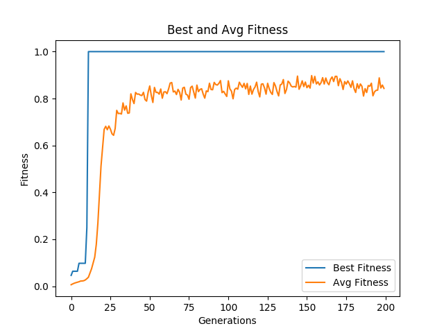
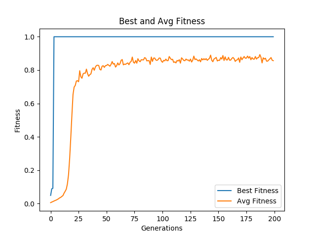
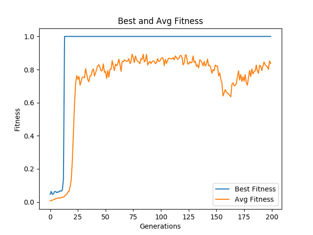
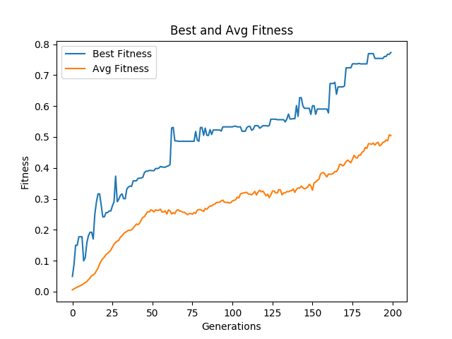

# Symbolic Regression with Genetic Programming

One of the standard use of Genetic Programmig (GP) is symbolic regression and in this project problem is with two dimensional *[Pythagoras Theorem]*(https://en.wikipedia.org/wiki/Pythagorean_theorem) $$ c^2 = a^2 + b^2 $$ in other way around $$ c = \sqrt {a^2 + b^2} $$. In this two dimensional case the problem to be solved is finding the $$ f $$ function that has is defined as $$ f(a_i, b_i) = c_i $$ with consideration of given inputs $$ <a_i, b_i, c_i> $$. In this sense, these inputs are called as fitness cases.

## Fitness Cases

| Side a | Side b | Hypotenus c |
|:------:|:------:|:-----------:|
|    3   |    5   |   5.830952  |
|    8   |   14   |  16.124515  |
|   18   |    2   |  18.110770  |
|   32   |   11   |  33.837849  |
|    4   |    3   |   5.000000  |
|   12   |   10   |  15.620499  |
|   21   |    6   |  21.840330  |
|    7   |    4   |   8.062258  |
|   16   |   24   |  28.844410  |
|    2   |    9   |   9.219544  |

**Function set:** { +, -, \*, /, sqrt }
**Terminal set:** { a, b, c }

- Implemented in Java with the help of *[ECJ Project]*(http://cs.gmu.edu/~eclab/projects/ecj/).

- Resulted solution trees and c syntax programms are under the results directory with some usefull python and bash scripts that are used for generating tree graphs in pdf form.

# Results
## With Elitizm
### Fitness Graphs
| Population Size |
|:---------------:|
|   300  |  1024  |
|:------:|:------:|
|  |  |

### Program Tree examples
**With C syntax**
- **Population 300 - GENERATION 14 :**  sqrt(a) \* sqrt(b \* ((a / b) + (b / a)))
- **Population 1024 - GENERATION 14 :** sqrt((a \* a) + (b \* b))

  

## Without Elitizm
### Fitness Graphs
| Population Size |
|:---------------:|
|   300  |  1024  |
|:------:|:------:|
| |  |

### Program Tree examples
**With C syntax**
- **Population 300 - GENERATION 14 :**  (sqrt(a) - (((b \* a) \* (b - b)) \* ((b - b) + ((a / b) \* b)))) \* sqrt(b \* ((a / b) + (((a + (b - b)) / a) / (a / b))))
- **Population 1024 - GENERATION 14 :** (a - sqrt(sqrt(sqrt(b)))) + (b \* sqrt((b / sqrt(b)) / (a + ((b / a) / sqrt((a - a) + (a + b))))))

 

